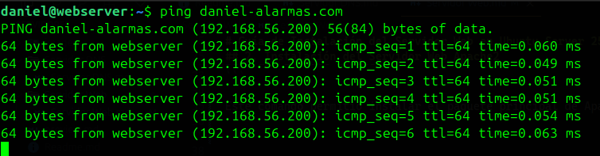

# Guía de Instalación del Servidor Web en Ubuntu Server 25.04

Esta guía documenta de forma detallada los pasos que se llevaron a cabo para instalar y configurar un servidor Web en un entorno basado en **Ubuntu Server 25.04**.

---

## 1. Requisitos Previos

Antes de iniciar el proceso de instalación, se verificó el cumplimiento de los siguientes requisitos esenciales:

* Sistema operativo Ubuntu previamente instalado (versión utilizada: **Ubuntu Server 25.04**).
* Acceso a una cuenta con privilegios administrativos (`sudo`) para realizar tareas de configuración.
* Conectividad de red estable y correctamente configurada para garantizar la comunicación con la red local o con Internet.

👉 En caso de no haber preparado el entorno, se recomienda revisar la guía correspondiente:

🔗 [Pasos previos a la instalación y configuración de los servidores](./preview.md "Primeros pasos antes de la instalación")

---

## 2. Instalación del Servidor Web Apache2

Para la implementación del servidor Web se eligió el software **Apache2**, reconocido por su estabilidad, flexibilidad y amplio soporte en sistemas Linux.

La instalación se realizó mediante la ejecución del siguiente comando en la terminal del servidor:

```bash
sudo apt install apache2
```

Este comando permitió instalar el paquete principal de Apache2, junto con todas las dependencias necesarias para su correcto funcionamiento.

---

## 3. Directorio de Publicación del Servidor Web

Tras la instalación, Apache2 configuró por defecto el siguiente directorio como raíz del servidor Web:

```bash
/var/www/html/
```

> Todo el contenido almacenado en este directorio fue servido públicamente a través del navegador mediante peticiones HTTP, salvo que se modificara la configuración predeterminada del servidor.

---

## 4. Asignación de Dirección IP

Como parte de la configuración de red, se asignó la dirección IP estática `192.168.56.200` al servidor Web, siguiendo la estructura definida en los registros DNS configurados previamente como se puede observar en la siguiente imagen:

