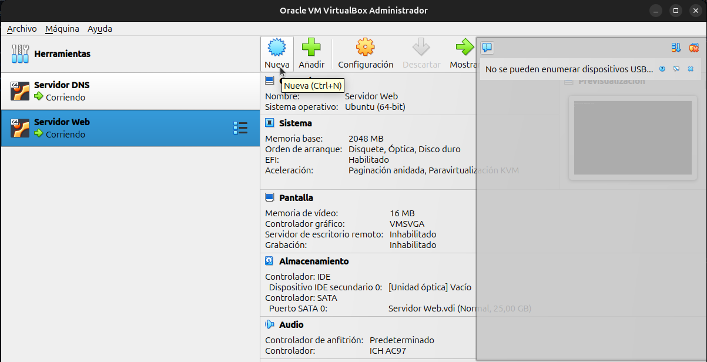
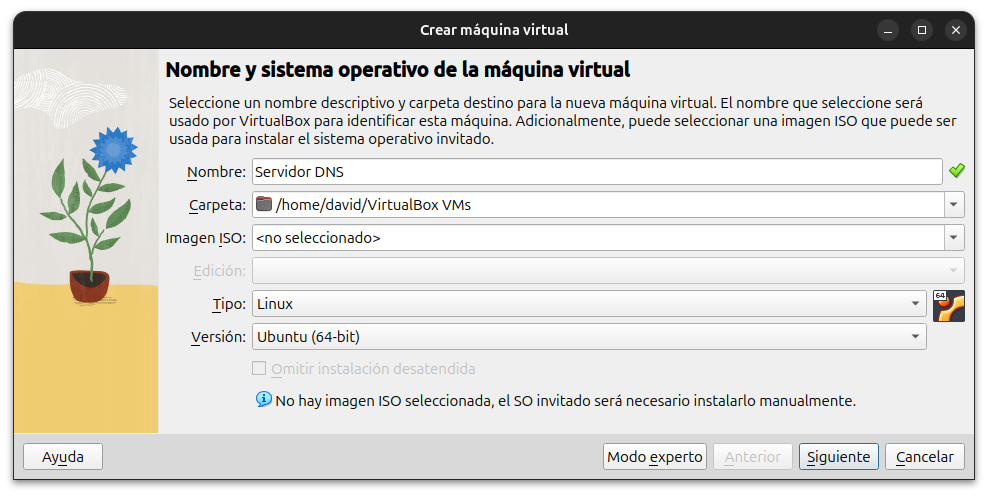
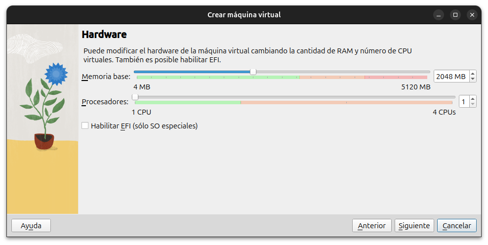
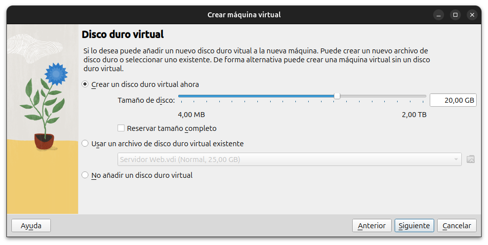
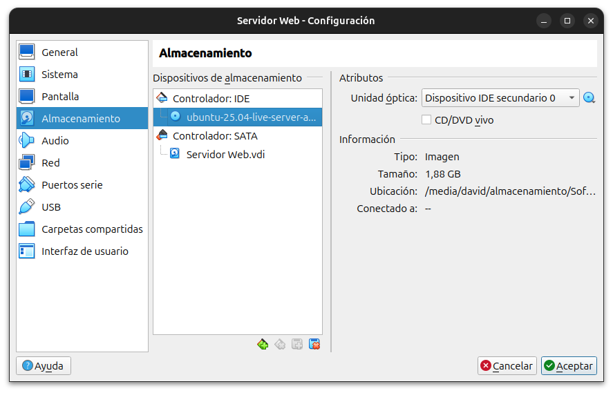
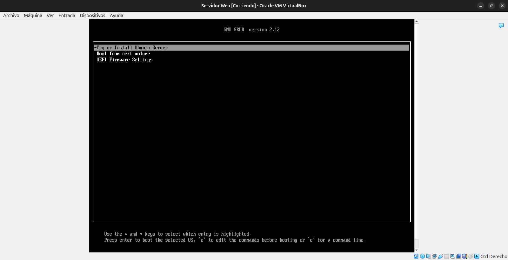
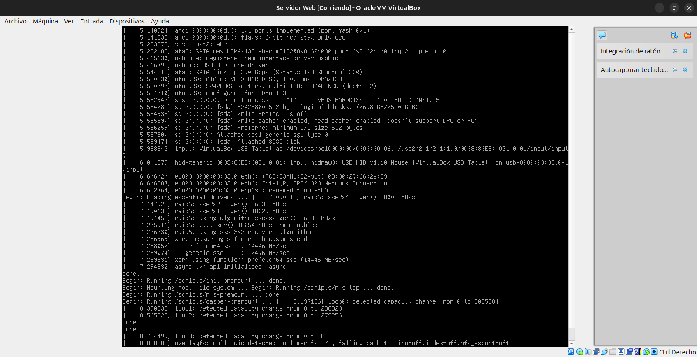

# Primeros pasos antes de la instalación de los servidores

[← Volver al índice principal](./Readme.md "Ir al contenido principal")

Antes de iniciar el proceso de instalación, es fundamental contar con una imagen del sistema operativo optimizado para entornos de servidor: **Ubuntu Server**.

Puedes descargar la versión más reciente desde su [sitio web oficial](https://ubuntu.com/download/server "Descargar Ubuntu Server").

> **Importante:** Aunque es posible utilizar cualquier distribución de Linux orientada a servidores, en este tutorial se ha elegido **Ubuntu Server** debido a su estabilidad, soporte a largo plazo (LTS) y amplia disponibilidad de documentación tanto oficial como comunitaria.
>
> Todos los procedimientos descritos, incluyendo la configuración de los servidores DNS y Web, han sido realizados sobre esta distribución.

## Creación de las máquinas virtuales

Antes de proceder con la creación de los servidores, es necesario instalar un software de virtualización que nos permita generar máquinas virtuales independientes para cada servicio.

> **Importante:** En este tutorial se ha utilizado **VirtualBox** como herramienta de virtualización.

### Instalación en sistemas basados en Debian (como Ubuntu)

Escriba el siguiente comando en la terminal para instalar el software de virtualización:

```bash
sudo apt install virtualbox
```

### Instalación en otros sistemas operativos

Si estás utilizando Windows, macOS u otra distribución de Linux, puedes descargar VirtualBox directamente desde su [sitio web oficial](https://www.oracle.com/virtualization/technologies/vm/downloads/virtualbox-downloads.html "Descargar VirtualBox").

## Creación de la máquina virtual

Ahora que has instalado el software de virtualización siguiendo los pasos anteriores, se procede a crear las máquinas virtuales para poder instalar Ubuntu Server en ella.

### Creación de la máquina virtual «**`Servidor DNS`**»

Debemos seguir las instrucciones que indican el paso a paso de cómo crear la máquina virtual

- Paso 1: Abrimos VirtualBox y hacemos clic en `Nueva`.
    

- Paso 2: Rellene el formulario correspondiente. No seleccione ninguna imagen (ISO del SO). Los campos deben contener los siguientes datos:
    - **Nombre:** Servidor DNS (o si prefiere otro que haga referencia conceptualmente al servidor DNS).
    - **Carpeta:** /home/usuario/VirtualBox VMs. Puede dejar ese campo tal cual debe estar.
    - **Edición:** No cargue ninguna imagen aquí. Déjelo en blanco.
    - **Versión:** Ubuntu (64-bit). Dado que estamos utilizando Ubuntu Server como sistema operativo de servidor.
    

    Presione «Siguiente»

- Paso 3: Asigne los recursos necesarios
    

    Presione «Siguiente»

- Paso 4: Asigne el amacenamiento adecuado
    

    Presiones «Siguiente» y luego en «Terminar»

- Paso 5: Asigne la imagen de disco (ISO del Sistema Operativo) a la máquina virtual
    

    Presione «Aceptar»

- Paso 6: Inicie la máquina virtual
    

    Presione «Iniciar»

- Paso 7: Inicie la instalación del sistema operativo
    

    Presione «Instalar ahora»

- Paso 8: Una vez finalizada la instalación, procedemos a escribir el siguiente comando en la terminal para actualizar el sistema operativo:

    ```bash
    sudo apt update
    ```
